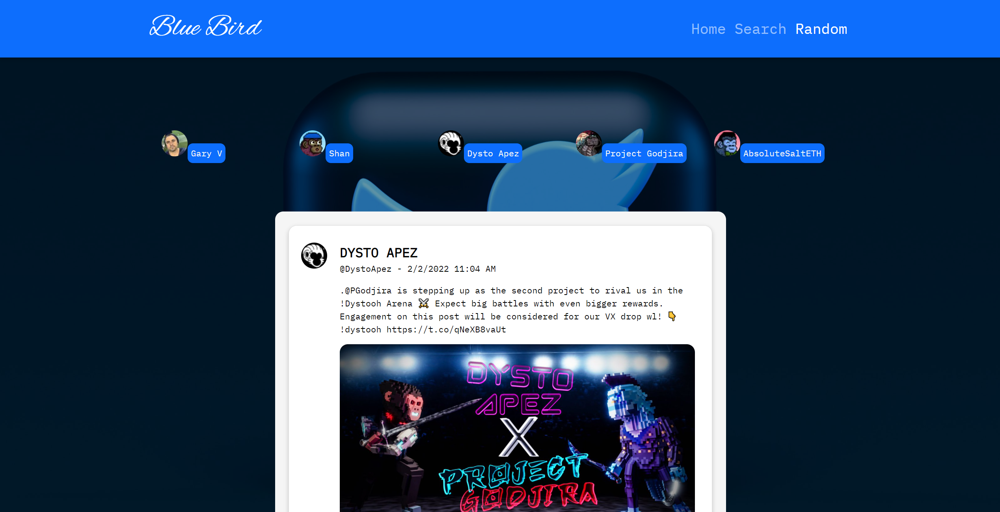

# Blue Bird Twitter API Application

# Overview

- Starwars character API application built with React JS and Bootstrap.
- Can search individual characters and view information on all characters from the API.

# Website

- See it [here](https://bluebirdtwitterapp.azurewebsites.net/) on Azure! 

# Preview

- Search Page (by twitter handle)

- Search Page (by content)

- Random User Page

# Summary

This is my second application using ReactJS but this time I decided to work with an API to pull and display data. I had previously built an expense tracker with ReactJS and used my progressing knowledge of state and hooks to build this application. Working with an API allowed me to get exposure to asynchronous programming and with the use of the Axios library I was easily able to make HTTP request to the Star Wars API (SWAPI). The SWAPI had 2 helpful query parameters, one for searching (/?search=) and one for navigating to specified pages (/?page=). Understanding these parameters and the data they each return was key to pulling the correct data and updating state within the application. Combining these query parameters in a single URL allowed me to incorporate search functionality as well as a pagination bar. Overall, after completing this project I was able to practice and improve my React skills and get experience with a popular API which are foundational to building and understanding full-stack applications. 

- Detailed Features:
    - Authenticate with Twitter API v2 using basic authentication
      - Internal API created with .NET Core Web API to interact with Twitter API v2 
    - Query the Twitter API v2 to return a user's usertimeline of tweets
      - Created custom UserTimeline C# object to represent JSON response from Twitter
      - Deserialize JSON response and manipulate fields to generate list of custom TweetObjects to return to frontend
    - Utilize async and await for asynchronous API calls
    - Render list of customized TweetObjects as the user's timeline using .map() technique on frontend
    - Endpoints:
      - /users/by/username/:username resource to grab a user's id
      - /users/:id/tweets to grab a user's timeline of tweets
      - /tweets/search/recent with the "?query" query parameter to retrieve recent tweets from a keyword search
    - TweetObject consists of:
      - User profile picture
      - Screename
      - Twitter handle
      - Text
      - Video preview images (full videos not supported on free tier plan)
      - Images
      - Public metrics (likes, comments, retweets)
    

In the project directory, you can run:

### `npm start`

Runs the app in the development mode.\
Open [http://localhost:3000](http://localhost:3000) to view it in your browser.

# Author

Brandon Chuck | Full Stack Developer | [LinkedIn](https://www.linkedin.com/in/brandonchuck/) | [Personal Website](www.brandonchuck-dev.com)
